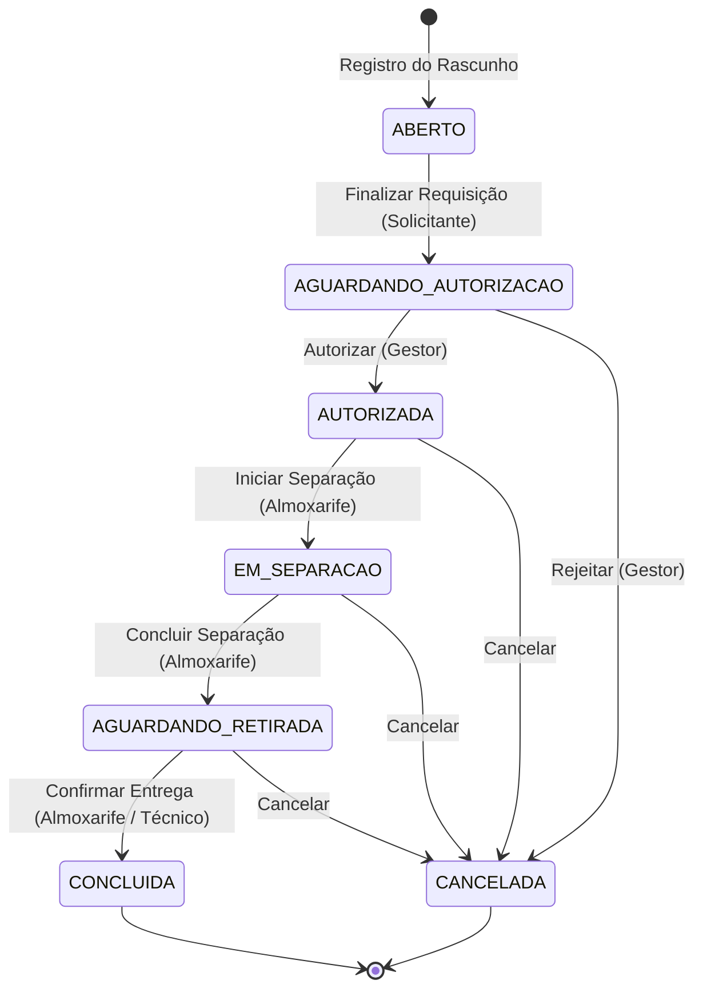

# Especificação Funcional — Módulo de Almoxarifado e Controle de Estoque

Este documento descreve as especificações funcionais e técnicas do **Módulo de Almoxarifado e Controle de Estoque** integrado ao SIGES, estabelecendo a arquitetura do banco de dados, fluxo de processamento de solicitações de materiais, regras de negócio e interfaces do usuário.

---

## 1. Arquitetura e Modelo de Dados (Supabase/PostgreSQL)

O módulo utiliza as tabelas descritas abaixo, seguindo o padrão de nomenclatura no plural para tabelas compostas:

### 1.1. Cadastro e Configurações

*   **`warehouses` (Almoxarifados):** Guarda os diferentes almoxarifados físicos do sistema. O controle de acesso e visibilidade é escopado por departamento (`department_id`).
*   **`materials_categories` (Categorias de Materiais):** Classificação taxonômica hierárquica dos materiais usando `parent_id` para subcategorias (ex: Ferramentas → Manuais).
*   **`materials` (Cadastro de Materiais):** Cadastro único e compartilhado de materiais do sistema (sem `company_id` ou `department_id`, facilitando o reuso de catálogo). Inclui controle de estoque mínimo (`min_stock`) e cálculo automático de custo médio ponderado (`cost_avg`).

### 1.2. Estoque e Custódia

*   **`warehouses_materials` (Estoque dos Almoxarifados):** Tabela de junção contendo o saldo atual físico de cada material por almoxarifado. Possui uma restrição de integridade para impedir saldos negativos (`CHECK quantity >= 0`).
*   **`users_materials` (Custódia do Usuário / Guarda):** Controla a quantidade de materiais sob posse/responsabilidade temporária de um determinado usuário (técnico). Também possui restrição que impede custódia negativa.

### 1.3. Movimentações e Solicitações (Mestre-Detalhe)

As solicitações e transferências são divididas em duas tabelas para permitir requisições com múltiplos materiais:

*   **`materials_movements` (Cabeçalho da Movimentação - Mestre):** Registra o tipo de transação, o status atual do fluxo, as entidades de origem/destino (almoxarifados ou usuários) e a rastreabilidade completa de auditoria (quem realizou cada etapa e quando).
*   **`materials_movements_items` (Itens da Movimentação - Detalhe):** Relação de materiais solicitados e atendidos, contendo as quantidades requisitadas, quantidades efetivamente entregues, custo unitário e valor total.

---

## 2. Ciclo de Vida da Movimentação (Status)

As movimentações de **Retirada (SAIDA)**, **Devolução (DEVOLUCAO)** e **Transferência (TRANSFERENCIA_ALMOX)** obedecem a um fluxo em 6 etapas:

### Detalhamento dos Estados:
1.  **ABERTO:** O solicitante está montando a lista de materiais. Ele pode adicionar, remover ou editar quantidades temporariamente. O estoque físico e a custódia não são afetados.
2.  **AGUARDANDO_AUTORIZACAO:** O solicitante enviou a requisição para análise. A requisição fica visível para os gestores do departamento correspondente.
3.  **AUTORIZADA:** O gestor com credenciais aprovou a saída do material.
4.  **EM_SEPARACAO:** O almoxarife iniciou o processo de separação física dos materiais nas prateleiras do estoque.
5.  **AGUARDANDO_RETIRADA:** A separação física foi concluída. Os itens estão embalados e reservados no balcão de atendimento do almoxarifado, aguardando que o técnico venha retirá-los.
6.  **CONCLUIDA:** O técnico retirou os materiais. O almoxarife confirma as quantidades entregues (ajustando se necessário) e os custos. **Apenas nesta etapa o estoque do almoxarifado é debitado e a custódia do técnico é creditada.**
7.  **CANCELADA:** A solicitação foi invalidada por alguma das partes. Exige preenchimento de justificativa de cancelamento/rejeição.

> **Nota:** Movimentações que não necessitam de ciclo de aprovação/separação (como **Entrada - ENTRADA**, **Ajustes - AJUSTE_POSITIVO/NEGATIVO** e **Baixa de OS - BAIXA_VISITA**) são criadas diretamente com o status `CONCLUIDA`.

---

## 3. Controle de Processamentos (Auditoria)

Todas as transições de status da tabela `materials_movements` salvam o usuário responsável pela ação e o carimbo de data/hora (timestamp), conforme as colunas abaixo:

*   **Rascunho criado:** `created_user_id` / `created_at`
*   **Enviado para autorização:** `submitted_user_id` / `submitted_at`
*   **Aprovado pelo Gestor:** `approver_user_id` / `approved_at`
*   **Separação iniciada:** `separator_user_id` / `separated_at`
*   **Separação concluída:** `separation_completed_user_id` / `separation_completed_at`
*   **Materiais entregues (Concluído):** `delivered_user_id` / `delivered_at`
*   **Cancelado / Rejeitado:** `cancelled_user_id` / `cancelled_at` (junto ao campo `rejection_note`)

---

## 4. Regras de Negócio Críticas (Triggers no Banco)

### 4.1. Atualização Automatizada de Saldos
Um trigger `AFTER UPDATE` (ou `AFTER INSERT` para casos diretos) na tabela `materials_movements` monitora a transição para `CONCLUIDA`. Quando detectado, lê todos os itens de `materials_movements_items` e atualiza as respectivas tabelas:
*   Subtrai quantidade física de `warehouses_materials` (origem).
*   Soma quantidade física na custódia `users_materials` (técnico receptor) ou em outro almoxarifado (destino).

### 4.2. Custo Médio Ponderado (CMP)
Sempre que uma movimentação do tipo `ENTRADA` atinge o status `CONCLUIDA`, o trigger recalcula o custo médio na tabela `materials` para cada item correspondente:
$$\text{CMP} = \frac{(\text{Estoque Geral Atual} \times \text{Custo Atual}) + (\text{Qtd Entrada} \times \text{Custo Entrada})}{\text{Estoque Geral Atual} + \text{Qtd Entrada}}$$

---

## 5. Interface do Usuário (Frontend - React)

As rotas são centralizadas sob o prefixo `/warehouse`.

### 5.1. Dashboard, Estoque e Alertas
*   **`WarehouseHome.tsx`:** Visão geral com KPIs (valor total estocado, movimentações pendentes, etc.) e listagem automática dos itens com estoque abaixo do mínimo (`v_low_stock_materials`).
*   **`WarehousesList.tsx` / `WarehouseDetail.tsx`:** Cadastro de almoxarifados e visualização da posição física dos itens em cada prateleira/local.
*   **`MaterialsList.tsx` / `MaterialDetail.tsx`:** Cadastro de materiais com controle de estoque mínimo e exibição do histórico de movimentações (Ficha Kardex do item).

### 5.2. Filtros e Acompanhamento das Solicitações
*   **Filtros Avançados (`MovementsList.tsx`):** Barra lateral de filtros combináveis:
    *   Filtro por múltiplos Status selecionados via checkbox.
    *   Filtro de Período de Data (inicial e final).
    *   Filtro por Almoxarifado de Origem/Destino.
    *   Filtro por Técnico/Solicitante.
    *   Filtro por Tipo de Movimentação (Saídas, Devoluções, Transferências).
    *   Busca textual livre.
*   **Linha do Tempo Visual (`MovementDetail.tsx`):** Um Stepper dinâmico desenhado na tela de detalhes do pedido que exibe o andamento da solicitação em tempo real (etapa atual e anteriores com os nomes dos responsáveis e horas).
*   **Tela de Triagem (`MovementsApprovals.tsx`):** Painel do gestor e do almoxarife, contendo abas de ação rápida:
    *   *Aba 1 (Pendentes de Autorização):* Permite ao gestor autorizar ou rejeitar solicitações.
    *   *Aba 2 (Pendentes de Separação):* Permite ao almoxarife sinalizar o início da separação de itens autorizados.
    *   *Aba 3 (Em Separação):* Permite ao almoxarife concluir a separação e encaminhar para o balcão.
    *   *Aba 4 (Prontas para Retirada):* Exibe itens aguardando retirada. Permite confirmar a entrega ao técnico, ajustar as quantidades finais entregues e finalizar como Concluída.

---

## 6. Integração com o Relatório do Ativo (OS)

*   Durante o preenchimento do relatório da visita (`OrderVisitAssetReport.tsx`), o técnico visualiza uma lista dinâmica de materiais presentes exclusivamente na sua custódia pessoal (`users_materials`).
*   Ele pode selecionar quais materiais consumiu para a manutenção do ativo atual e suas respectivas quantidades.
*   Ao salvar o relatório, o sistema cria automaticamente uma movimentação master de `BAIXA_VISITA` com status `CONCLUIDA` contendo todos os itens consumidos. 
*   A custódia do técnico é reduzida na hora de forma automatizada pelo trigger do banco de dados.
*   O vínculo de `order_visit_asset_id` é registrado em `materials_movements` para rastreamento futuro em auditorias.
