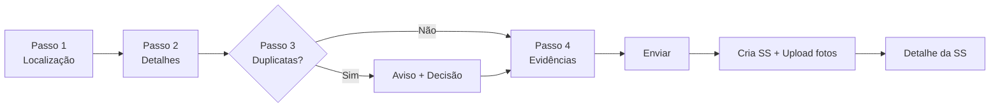

# 02 — Solicitações de Serviço (SS)

> **Perfil:** Técnico, Líder, Gestor, Admin  
> **Rota:** `/service-request` → Botão "Nova SS"  
> **Status inicial:** `1 — Aberta` (order_mask: `{contador}.0.{ano}`)

---

## 1. O que é uma Solicitação de Serviço (SS)?

A **SS** é o **registro inicial** de um problema ou necessidade de manutenção em uma unidade/cliente. É a "mãe" de uma ou mais **Ordens de Serviço (OS)**, que serão geradas a partir dela para execução prática.

### Quando usar
- Cliente reporta falha, vazamento, defeito, necessidade de instalação
- Técnico identifica problema durante visita preventiva
- Gestor agenda manutenção programada

### O que NÃO é SS
- Execução do serviço (isso é OS/Visita)
- Compra de material (isso é Almoxarifado)
- Cadastro de equipamento (isso é Ativos)

---

## 2. Como Acessar

| Origem | Ação |
|--------|------|
| **Dashboard de Ordens** | Botão "Nova SS" |
| **Dashboard de Visitas** | Botão "Nova SS" |
| **Dashboard de Unidades/Ativos** | Botão de criar SS no detalhe |
| **Detalhe de SS existente** | Botão "Editar" ou "Clonar" |
| **Contexto de Unidade/Ativo/Tag** | Inicia no **Passo 2** (localização pré-preenchida) |

---

## 3. Visão Geral do Fluxo (Wizard de 4 Passos)



> ⚠️ **No modo Edição:** Passo 3 (Duplicatas) é **pulado** automaticamente.

---

## 4. Passo a Passo Detalhado

### Passo 1 — Localização

| Campo | Obrigatório | Descrição |
|-------|:-----------:|-----------|
| **Cliente** | ✅ | Seleciona o cliente/pessoa jurídica |
| **Unidade** | ✅ | Unidade do cliente (depende do cliente) |
| **Setor > Posição** | ❌ | Localização exata dentro da unidade (depende da unidade) |

#### Regras de Dependência
```
Cliente ──▶ Unidade ──▶ Setor > Posição
```

- Trocar **Cliente** → Reseta Unidade e Setor
- Trocar **Unidade** → Reseta Setor
- Unidade só habilita após Cliente
- Setor só habilita após Unidade

#### 💡 Dica
Use a **busca** (digita nome/código) nas listas — são paginadas com scroll infinito.

---

### Passo 2 — Detalhes do Serviço

| Campo | Obrigatório | Descrição |
|-------|:-----------:|-----------|
| **Tipo de OS** | ✅ | Tipo do serviço (ex: Manutenção, Instalação, Vistoria) |
| **Prioridade** | ❌ | Nível de urgência (Baixa, Média, Alta, Crítica) |
| **Descrição do Problema** | ✅ | Mínimo **10 caracteres**. Seja detalhado. |

#### Exemplo de Descrição Boa
```
Realizar vistoria no painel GMB01: não liga, LED piscando vermelho intermitente.
Cliente relata queda de energia ontem à noite. Verificar disjuntores e fonte.
```

#### Exemplo de Descrição Ruim
```
Painel com problema.
```

> ⚠️ **Validação:** Menos de 10 caracteres bloqueia o envio.

---

### Passo 3 — Verificação de Duplicatas (Automático)

O sistema verifica **automaticamente** se já existe SS com:
- Mesma **Unidade**
- Mesmo **Setor/Posição**  
- Mesmo **Tipo de Serviço**

| Situação | O que Acontece |
|----------|----------------|
| Nenhuma duplicata | Avança direto para Passo 4 |
| Duplicatas encontradas | Exibe aviso com lista das SSs existentes |

#### Se Houver Duplicatas — Suas Opções
| Ação | Quando Usar |
|------|-------------|
| **Visualizar** | Abre detalhe da SS existente para conferir |
| **Continuar** | Cria nova SS mesmo assim (problema diferente) |
| **Voltar** | Ajusta dados no Passo 2 (ex: tipo de serviço errado) |

---

### Passo 4 — Evidências (Fotos)

| Ação | Como Fazer |
|------|------------|
| **Adicionar Foto** | Galeria ou Câmera (botão "+") |
| **Editar Foto** | Clique na foto → Editor (recortar, ajustar) |
| **Excluir Foto** | Clique na foto → Ícone lixeira |
| **Visualizar** | Clique na foto → Tela cheia |

#### Regras
- **Máximo 4 fotos** por SS
- Formatos: JPEG, PNG, HEIC (via galeria/câmera)
- Fotos são enviadas **após** criação da SS no banco
- Nomes originais são preservados; caminho: `companies/{company_id}/orders/{order_id}/images`

---

## 5. Enviando a SS

Após preencher tudo, clique em **"Enviar"** (ou **"Salvar Edição"** se editando).

### O que Acontece nos Bastidores

```
1. Validação dos campos obrigatórios
           │
2. Resolução dos dados do usuário logado
   (empresa, departamento, equipe)
           │
3. Resolução dos dados da unidade
   (endereço, sistema, coordenadas GPS)
           │
4. Resolução do tipo e prioridade
           │
5. Geração do contador da SS
   (formato: {contador}.0.{ano} → ex: "42.0.2026")
           │
6. Inserção no banco (tabela orders)
   - parent_id = null (indica que é SS)
   - status_id = 1 (Aberta)
           │
7. Upload das fotos para storage
           │
8. Redirecionamento para o detalhe da SS
```

### Formato da Máscara (order_mask)
```
{contador}.0.{ano}

Exemplos:
  1.0.2026   → Primeira SS do ano 2026
  42.0.2026  → 42ª SS do ano 2026
  127.0.2026 → 127ª SS do ano 2026
```

---

## 6. Casos de Uso Especiais

### Editar uma SS
1. Acesse o **detalhe da SS** → Botão "Editar"
2. O **Passo 3 (Verificação)** é pulado
3. Fotos existentes: podem ser mantidas, removidas ou substituídas
4. Clique **"Salvar Edição"**

### Clonar uma SS
1. Acesse o **detalhe da SS** → Botão "Clonar"
2. Modal pede a **Unidade de Destino**
3. Dados são copiados para a nova unidade (contador novo)
4. Útil para: mesmo problema em múltiplas unidades do mesmo cliente

### Criar SS com Contexto Pré-preenchido
- Ao criar a partir de **Unidade / Ativo / Tag** → Inicia no **Passo 2**
- Localização (Cliente, Unidade, Setor) já vem preenchida
- Economiza tempo em visitas programadas

---

## 7. Campos Armazenados no Banco (Referência)

| Campo | Origem | Descrição |
|-------|--------|-----------|
| `parent_id` | Fixo `null` | Indica que é SS (não OS) |
| `status_id` | Fixo `1` | Status inicial: Aberta |
| `client_id` | Formulário | ID do cliente |
| `unit_id` | Formulário | ID da unidade |
| `type_id` | Formulário | Tipo do serviço |
| `priority_id` | Formulário | Prioridade |
| `requested_services` | Formulário | Descrição do problema |
| `order_mask` | Gerado | Máscara: `{counter}.0.{year}` |
| `company_id` | Usuário logado | Empresa do solicitante |
| `requester_name` | Usuário logado | Nome de quem solicitou |
| `created_at` | Sistema | Data/hora (fuso Brasil) |

---

## 8. Validações e Erros Comuns

| Mensagem de Erro | Causa | Solução |
|------------------|-------|---------|
| "Preencha todos os campos obrigatórios" | Cliente, Unidade, Tipo ou Descrição faltando | Complete os campos marcados com * |
| "A descrição deve ter pelo menos 10 caracteres" | Texto muito curto | Escreva mais detalhes do problema |
| "Erro ao salvar. Tente novamente." | Falha de conexão / servidor | Verifique internet, tente novamente |
| "Máximo de 4 fotos permitido" | Tentou adicionar 5ª foto | Remova uma antes de adicionar outra |
| "Unidade não encontrada" | Dados inconsistentes | Volte ao Passo 1, reselecione |

---

## 9. Regras de Negócio Importantes

| Regra | Impacto |
|-------|---------|
| SS **sempre** tem `parent_id = null` | Diferencia de OS no banco |
| Contador é **por empresa + ano** | Reinicia a cada ano |
| Fotos vão para **storage separado** | Não pesa no banco |
| SS aberta **não gera OS automaticamente** | Gestor deve converter manualmente |
| Edição **não reabre verificação de duplicatas** | Evita loops |

---

## 10. Dicas e Boas Práticas

1. **Descreva detalhadamente** — Quanto mais info, mais rápido a equipe resolve
2. **Anexe fotos** — Evidências visuais evitam idas desnecessárias
3. **Verifique duplicatas** — Pode ser que o problema já foi reportado
4. **Use prioridade correta** — Não marque tudo "Crítica"; sobrecarrega a triagem
5. **Clone para unidades similares** — Mesmo problema em vários locais = clone + ajuste

---

## 11. Perguntas Frequentes (FAQ — SS)

| Pergunta | Resposta |
|----------|----------|
| **Posso apagar uma SS?** | Não. Apenas cancelar (status = Cancelada) com justificativa. |
| **SS vira OS automaticamente?** | Não. Gestor acessa a SS → "Gerar OS". |
| **Quantas OS uma SS pode gerar?** | Múltiplas (ex: serviços diferentes para o mesmo problema). |
| **Fotos ficam na SS ou na OS?** | Na SS. A OS herda referência, mas fotos ficam na pasta da SS. |
| **Posso criar SS offline?** | Sim. Fica em fila local; sincroniza ao voltar online. |
| **O contador reinicia todo ano?** | Sim. Formato `{counter}.0.{year}` — em 2027 volta para `1.0.2027`. |

---

## 12. Links Relacionados

- [Cap. 03 — Ordens de Serviço (OS)](./03-ordens-servico.md) — Próximo passo após SS
- [Cap. 04 — Visitas Técnicas](./04-visitas-tecnicas.md) — Execução em campo
- [Cap. 07 — Almoxarifado](./07-almoxarifado.md) — Materiais para o serviço
- [Cap. 11 — Glossário](./11-faq-glossario.md) — Termos técnicos