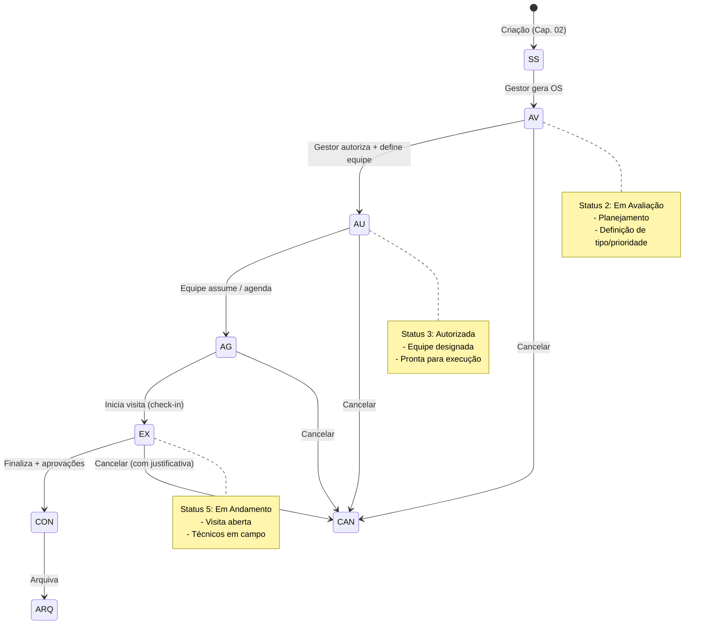

# 03 — Ordens de Serviço (OS)

> **Perfil:** Gestor, Líder, Admin (criação/autorização) • Técnico (visualização)  
> **Rota:** `/orders` → Detalhe da SS → "Gerar OS"  
> **Status iniciais:** `2 — Em Avaliação` → `3 — Autorizada` → `4 — Agendada` → `5 — Em Andamento`  
> **Máscara:** `{SS.contador}.{filho}.{ano}` (ex: `42.1.2026`)

---

## 1. O que é uma Ordem de Serviço (OS)?

A **OS** é o documento de **planejamento e autorização** derivado de uma **Solicitação de Serviço (SS)**. Enquanto a SS registra "o que aconteceu", a OS define "o que será feito, por quem, quando e com quais recursos".

### Diferença SS vs OS

| Aspecto | SS (Solicitação) | OS (Ordem) |
|---------|------------------|------------|
| **Origem** | Cliente / Técnico / Sistema | Gestor (a partir da SS) |
| **Propósito** | Registrar necessidade | Planejar e autorizar execução |
| **Máscara** | `42.0.2026` | `42.1.2026`, `42.2.2026`... |
| **parent_id** | `null` | `SS.id` |
| **Status inicial** | 1 — Aberta | 2 — Em Avaliação |
| **Quantidade** | 1 por problema | Múltiplas por SS |

> **Regra:** **Não é possível criar OS sem SS** (parent_id obrigatório).

---

## 2. Como Acessar / Criar

| Origem | Ação |
|--------|------|
| **Detalhe da SS** | Botão "Gerar OS" (apenas perfis com permissão) |
| **Lista de Ordens** | `/orders` → Visualiza todas (filtráveis) |
| **Dashboard** | Card "Ordens em Avaliação" / "Autorizadas" |

---

## 3. Fluxo de Status da OS



### Códigos de Status (orders.status_id)

| ID | Código | Label | Quem Move | Próximo |
|----|--------|-------|-----------|---------|
| 1 | NP | Não Programada | — | (apenas SS) |
| 2 | AV | Em Avaliação | Gestor gera OS | → 3 (Autorizar) |
| 3 | AU | Autorizada | Gestor autoriza | → 4 (Agendar) |
| 4 | AG | Agendada | Líder assume/agenda | → 5 (Iniciar) |
| 5 | EX | Em Andamento | Líder inicia visita | → 8 (Concluir) |
| 6 | AP | Aprovada | Após aprovações | → 8 |
| 7 | RE | Rejeitada | Qualquer rejeição | → 2 ou 4 |
| 8 | CO | Concluída | Finalização completa | → 9 (Arquivar) |
| 9 | AR | Arquivada | Admin/Gestor | Fim |

---

## 4. Criando uma OS (Passo a Passo)

### Pré-requisitos
- ✅ SS existente (status Aberta ou Em Avaliação)
- ✅ Permissão: `orders_create` + `orders_authorize` (perfil Gestor/Admin)
- ✅ Usuário logado com empresa/departamento definidos

### Formulário de Nova OS

| Campo | Obrigatório | Origem / Opções |
|-------|:-----------:|-----------------|
| **Tipo de OS** | ✅ | `cfg_order_types` (filtrado por empresa + disponível) |
| **Subtipo** | ✅ | `cfg_order_type_subs` (filtrado por empresa + disponível) |
| **Objeto/Equipamento** | ✅ | `cfg_objects` (filtrado por empresa) |
| **Contrato** | ✅ | `contracts` (filtrado por departamento do usuário) |
| **Prioridade** | ❌ | Herda da SS (editável) |
| **Descrição do Serviço** | ✅ | Herda da SS (editável) |
| **Plano** | ❌ | Seleção opcional |
| **Imagens** | ❌ | Até 4 (herda da SS + novas) |

#### Valores Herdados da SS (editáveis)
- `orderTypeId` ← `SS.type_id`
- `priorityId` ← `SS.priority_id`
- `contractId` ← `SS.contract_id` (se existir)
- `requestedServices` ← `SS.requested_services`

#### Campos Preenchidos Automaticamente (não editáveis)
| Campo | Origem |
|-------|--------|
| `unit_id` | `SS.unit_id` |
| `client_id` | `SS.client_id` |
| `system_id` | `SS.system_id` |
| `year` | `SS.year` |
| `company_id` | `usuário.logado.cfg_teams.company_id` |
| `department_id` | `usuário.logado.cfg_teams.department_id` |
| `requester_name` | `usuário.logado.name_short` |
| `requester_team_id` | `usuário.logado.team_id` |
| `requester_phone` | `usuário.logado.mobile_mask` ou `mobile` |
| `provider_company_id` | `contrato.provider_company_id` |
| `provider_department_id` | `contrato.provider_department_id` |

---

## 5. Autorização da OS (Gestor)

Após criar, a OS fica em **Status 2 — Em Avaliação**. O gestor deve:

1. Acessar a OS → Botão **"Autorizar"**
2. Selecionar **Equipe Responsável** (`teamId`)
3. Confirmar → Status muda para **3 — Autorizada**

### O que Acontece na Autorização
- `orders.team_id` = equipe selecionada
- `orders.status_id` = 3 (Autorizada)
- `orders.status_at` = timestamp Brasil
- Notificação enviada para a equipe designada

---

## 6. Assumir / Encaminhar (Equipe da Contratada)

Com OS **Autorizada (3)**, a equipe designada acessa:

| Ação | Quando | Resultado |
|------|--------|-----------|
| **Assumir** | Equipe vai executar | Cria 1ª Visita → Status OS = 5 (Em Andamento) |
| **Encaminhar** | Outra equipe deve fazer | Muda `team_id` → Status OS = 4 (Agendada) |

> ⚠️ **Encaminhar** só permitido se **não houver visita aberta** para essa OS.

---

## 7. Fechamento da OS (Encerramento)

A OS só vai para **Concluída (8)** quando:
- ✅ Todas as visitas finalizadas
- ✅ Aprovação técnica concluída (processing = 5)
- ✅ Aprovação financeira concluída (ov_costs_status = approved) — *se feature ativa*
- ✅ Relatório final salvo

### Botão "Concluir OS"
- Disponível no detalhe da OS (apenas Gestor/Admin)
- Valida condições acima
- Muda `status_id` = 8
- Atualiza SS mãe se não houver outras OS em andamento

---

## 8. Máscara da OS (order_mask)

```
{SS.contador}.{filho}.{ano}

Exemplos:
  SS: 42.0.2026
  OS 1: 42.1.2026
  OS 2: 42.2.2026
  OS 3: 42.3.2026
```

- `counter_child` incrementa a cada OS criada para a mesma SS
- Garante rastreabilidade: OS pertence à SS `42.0.2026`

---

## 9. Validações e Erros Comuns

| Erro | Causa | Solução |
|------|-------|---------|
| "Não é possível criar uma nova OS sem uma SS" | Tentou criar OS raiz | Acesse uma SS primeiro → "Gerar OS" |
| "Contrato não encontrado para este departamento" | Contrato não vinculado ao dept | Selecione contrato válido ou peça ao admin |
| "Tipo de OS indisponível" | `is_available = false` ou empresa diferente | Escolha tipo ativo da sua empresa |
| "Equipe já possui visita em andamento" | Tentou assumir mas já tem visita aberta | Finalize a visita atual primeiro |
| "Não é possível encaminhar: visita em andamento" | OS já tem visita aberta | Finalize ou cancele a visita antes |

---

## 10. Regras de Negócio Importantes

| Regra | Descrição |
|-------|-----------|
| **Transacional** | Criação da OS + incremento de contador = uma transação (rollback total se falhar) |
| **Contador anual** | Bloqueado durante leitura/incremento (evita duplicatas) |
| **Máx. 4 imagens** | Herda da SS + novas; total ≤ 4 |
| **Fuso horário** | Todos timestamps em America/Sao_Paulo |
| **SS mãe atualiza** | Se OS entra "Em Andamento" e não há outra OS andando → SS.status = 5 |
| **Campos fixos** | Não é possível adicionar campos além dos definidos no fluxo |

---

## 11. Casos de Uso Especiais

### OS para Manutenção Preventiva (Programada)
- SS criada com antecedência (tipo "Preventiva")
- OS gerada com plano (`plan_id`) vinculado
- Agendamento via data prevista no contrato

### OS de Emergência
- Prioridade = Crítica
- Autorização rápida (gestor recebe push notification)
- Equipe assume direto (pula "Agendada" → vai para "Em Andamento")

### Múltiplas OS para uma SS
- Ex: SS "Vazamento na unidade" → OS 1: "Encanamento" + OS 2: "Elétrica" + OS 3: "Pintura"
- Cada OS com equipe/tipo diferente
- SS só conclui quando **todas** OS concluírem

---

## 12. Dicas e Boas Práticas

1. **Preencha tipo/subtipo corretos** — Afeta relatórios, SLA e cobrança
2. **Vincule o contrato certo** — Define prestadora, valores, regras
3. **Autorize com equipe certa** — Evita reencaminhamentos (atraso + confusão)
4. **Anexe fotos na SS** — OS herda; evita retrabalho
5. **Use "Encaminhar" com parcimônia** — Cada troca = notificação + delay

---

## 13. Perguntas Frequentes (FAQ — OS)

| Pergunta | Resposta |
|----------|----------|
| **Posso editar OS após autorizada?** | Campos limitados. Para mudar equipe: use "Encaminhar". |
| **OS cancelada volta para SS?** | SS fica como estava. Pode gerar nova OS depois. |
| **Quantas OS por SS?** | Ilimitadas (contador filho incrementa: .1, .2, .3...). |
| **Técnico pode criar OS?** | Não. Apenas Gestor/Líder/Admin com permissão `orders_create`. |
| **O que é "Objeto/Equipamento"?** | Item do catálogo `cfg_objects` (ex: Bomba, Painel, Chiller). |
| **Prioridade da OS pode ser diferente da SS?** | Sim, é editável no formulário de criação da OS. |

---

## 14. Links Relacionados

- [Cap. 02 — Solicitações de Serviço (SS)](./02-solicitacoes-servico.md) — Origem da OS
- [Cap. 04 — Visitas Técnicas](./04-visitas-tecnicas.md) — Execução da OS
- [Cap. 05 — Ativos e Equipamentos](./05-ativos-equipamentos.md) — Objetos/Equipamentos
- [Cap. 08 — Equipes e Colaboradores](./08-equipes-colaboradores.md) — Designação de equipes
- [Cap. 11 — Glossário](./11-faq-glossario.md) — Termos técnicos