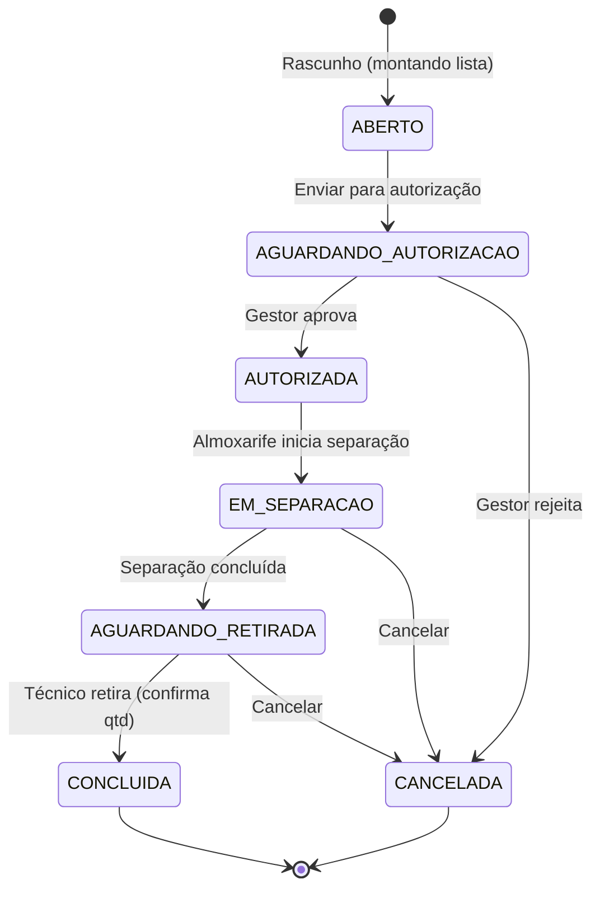

# 07 — Almoxarifado e Controle de Estoque

> **Perfil:** Almoxarife (operação) • Técnico (requisição/retirada) • Gestor (autorização, relatórios) • Admin (configuração)  
> **Rota:** `/warehouse` → Dashboard / Estoque / Solicitações / Triagem / Materiais  
> **Tabelas-chave:** `warehouses`, `materials`, `materials_categories`, `warehouses_materials`, `users_materials`, `materials_movements`, `materials_movements_items`

---

## 1. O que é o Módulo Almoxarifado?

Controla **todo o ciclo de materiais**: cadastro, estoque físico por almoxarifado, solicitações de retirada/devolução/transferência, custódia técnica, custo médio ponderado (CMP) e integração com visitas/OS.

### Conceitos Fundamentais

| Conceito | Tabela | Descrição |
|----------|--------|-----------|
| **Almoxarifado** | `warehouses` | Local físico de armazenamento (escopado por departamento) |
| **Material** | `materials` | Cadastro único compartilhado (catálogo global) |
| **Categoria** | `materials_categories` | Hierárquica (parent_id) — ex: Ferramentas → Manuais |
| **Estoque Físico** | `warehouses_materials` | Saldo atual por material × almoxarifado (≥ 0) |
| **Custódia Técnica** | `users_materials` | Materiais sob responsabilidade do técnico (≥ 0) |
| **Movimentação** | `materials_movements` + `_items` | Mestre-detalhe: requisições com múltiplos itens |

---

## 2. Ciclo de Vida da Movimentação (Status)

Aplicável a: **Retirada (SAIDA)**, **Devolução (DEVOLUCAO)**, **Transferência (TRANSFERENCIA_ALMOX)**



### Estados em Detalhe

| Status | Quem Age | O que Acontece | Estoque Afetado? |
|--------|----------|----------------|------------------|
| **ABERTO** | Solicitante | Monta lista, edita quantidades | ❌ Não |
| **AGUARDANDO_AUTORIZACAO** | — | Visível para gestores do departamento | ❌ Não |
| **AUTORIZADA** | Gestor | Aprova saída | ❌ Não |
| **EM_SEPARACAO** | Almoxarife | Separa fisicamente nas prateleiras | ❌ Não |
| **AGUARDANDO_RETIRADA** | Almoxarife | Itens reservados no balcão | ❌ Não |
| **CONCLUIDA** | Almoxarife/Técnico | Confirma entrega, ajusta qtd final | ✅ **SIM** (baixa estoque + sobe custódia) |
| **CANCELADA** | Qualquer | Invalida + justificativa | ❌ Não |

> **Movimentações Diretas (sem ciclo):** `ENTRADA`, `AJUSTE_POSITIVO/NEGATIVO`, `BAIXA_VISITA` → criadas já como **CONCLUIDA**.

---

## 3. Auditoria Completa (Rastreabilidade)

Toda transição de status registra **quem** e **quando**:

| Ação | Campos Preenchidos |
|------|-------------------|
| Rascunho criado | `created_user_id`, `created_at` |
| Enviado p/ autorização | `submitted_user_id`, `submitted_at` |
| Aprovado (Gestor) | `approver_user_id`, `approved_at` |
| Separação iniciada | `separator_user_id`, `separated_at` |
| Separação concluída | `separation_completed_user_id`, `separation_completed_at` |
| Entregue (Concluída) | `delivered_user_id`, `delivered_at` |
| Cancelado/Rejeitado | `cancelled_user_id`, `cancelled_at`, `rejection_note` |

---

## 4. Regras Críticas (Triggers no Banco)

### 4.1 Atualização Automática de Saldos (Trigger `AFTER UPDATE`)

Ao transicionar para **CONCLUIDA**:
1. Lê itens em `materials_movements_items`
2. **Subtrai** qtd de `warehouses_materials` (origem)
3. **Soma** qtd em `users_materials` (técnico) ou outro almoxarifado (destino)
4. **Impede saldo negativo** (constraint `CHECK quantity >= 0`)

### 4.2 Custo Médio Ponderado (CMP)

Ao concluir `ENTRADA`:
```
CMP = (Estoque_Atual × Custo_Atual + Qtd_Entrada × Custo_Entrada) / (Estoque_Atual + Qtd_Entrada)
```
- Atualiza `materials.cost_avg` automaticamente
- Usado para valorização de saída e relatórios

---

## 5. Interface do Usuário (Rotas `/warehouse`)

### 5.1 Dashboard e Alertas (`WarehouseHome`)
- KPIs: Valor total estocado, movimentações pendentes, itens abaixo do mínimo
- Lista automática de **estoque baixo** (`v_low_stock_materials`)

### 5.2 Cadastro (`WarehousesList` / `WarehouseDetail` / `MaterialsList` / `MaterialDetail`)
- Almoxarifados: CRUD + visualização por prateleira/local
- Materiais: Cadastro global + estoque mínimo + **Ficha Kardex** (histórico completo)

### 5.3 Filtros Avançados (`MovementsList`)
- Múltiplos status (checkbox)
- Período de data (início/fim)
- Almoxarifado origem/destino
- Técnico/Solicitante
- Tipo (Saídas, Devoluções, Transferências)
- Busca textual livre

### 5.4 Linha do Tempo Visual (`MovementDetail`)
- Stepper dinâmico: etapa atual + anteriores com responsáveis + horários
- Tempo real

### 5.5 Tela de Triagem (`MovementsApprovals`) — **Painel do Gestor/Almoxarife**

| Aba | Ação | Perfil |
|-----|------|--------|
| **1. Pendentes Autorização** | Autorizar / Rejeitar | Gestor |
| **2. Pendentes Separação** | Iniciar separação | Almoxarife |
| **3. Em Separação** | Concluir separação → balcão | Almoxarife |
| **4. Prontas Retirada** | Confirmar entrega, ajustar qtd, finalizar | Almoxarife |

---

## 6. Fluxos Operacionais (Passo a Passo)

### 6.1 Solicitar Materiais (Técnico → Retirada/SAIDA)
1. Acesse `/warehouse` → "Nova Solicitação"
2. Tipo: **Retirada (SAIDA)**
3. Almoxarifado de origem (filtrado por departamento)
4. Adicione itens: Material + Quantidade solicitada
5. Salve como **Rascunho (ABERTO)** — edita à vontade
6. **"Enviar para Autorização"** → Status: `AGUARDANDO_AUTORIZACAO`
7. Gestor recebe notificação → **Autoriza** ou **Rejeita**
8. Se autorizado → Almoxarife separa → **Conclui separação**
9. Técnico vai ao balcão → Almoxarife **Confirma Entrega** (ajusta qtd se needed) → **CONCLUIDA**
10. **Automático:** Estoque baixa, custódia do técnico sobe

### 6.2 Devolver Materiais (Técnico → Devolução/DEVOLUCAO)
1. Nova Solicitação → Tipo: **Devolução**
2. Itens vêm da **custódia do técnico** (`users_materials`) — seleciona o que devolve
3. Mesmo ciclo: Autorização → Separação (conferência) → Conclusão
4. **Automático:** Custódia baixa, estoque sobe

### 6.3 Transferir entre Almoxarifados (Almoxarife → TRANSFERENCIA_ALMOX)
1. Nova Solicitação → Tipo: **Transferência**
2. Origem + Destino (ambos do mesmo departamento ou autorizados)
4. Itens + qtd
5. Ciclo similar, mas destino é outro almoxarifado (não técnico)

### 6.4 Entrada de Nota Fiscal (Almoxarife/Gestor → ENTRADA)
1. Nova Movimentação → Tipo: **Entrada**
2. **Criada direto como CONCLUIDA** (sem ciclo de aprovação)
3. Itens: Material + Qtd + Valor Unitário + Nota Fiscal
4. **Automático:** Estoque sobe + **Recalcula CMP**

### 6.5 Ajuste de Estoque (Almoxarife → AJUSTE_POSITIVO/NEGATIVO)
- Diferença de inventário físico vs sistema
- **Direto CONCLUIDA** + justificativa obrigatória
- Positivo = achado / Negativo = perda/quebra

### 6.6 Baixa de Visita (Automático → BAIXA_VISITA)
- Durante **Relatório de Visita** (Cap. 04), aba "Materiais"
- Técnico seleciona materiais da **sua custódia** usados no ativo
- Ao salvar relatório → Cria `materials_movements` tipo `BAIXA_VISITA` **CONCLUIDA**
- **Automático:** Custódia baixa, vinculado à `order_visit_asset_id` para auditoria

---

## 7. Custódia do Técnico (`users_materials`)

### O que é
Quantidade de materiais sob **responsabilidade temporária** do técnico (no carro, na mochila, no armário).

### Como Aumenta
- Retirada CONCLUIDA (almoxarife entrega)
- Transferência recebida

### Como Diminui
- Devolução CONCLUIDA
- Baixa de Visita (consumo em OS)
- Transferência enviada

### Consulta
- `/warehouse` → "Minha Custódia" (técnico vê só a dele)
- Gestor vê de toda equipe
- Ficha Kardex por material mostra entradas/saídas da custódia

---

## 8. Integração com Visita/OS (Baixa de Visita)

### No Relatório da Visita (Cap. 04)
1. Aba **Materiais** → Lista dinâmica da custódia do técnico (`users_materials`)
2. Marca quais consumiu + quantidades
3. Salva relatório

### Nos Bastidores
- Cria `materials_movements`:
  - `type = BAIXA_VISITA`
  - `status = CONCLUIDA`
  - `order_visit_asset_id` = ativo intervencionado
  - Itens = materiais consumidos
- Trigger baixa `users_materials` do técnico
- Rastreabilidade total: qual visita, qual ativo, qual OS, quem consumiu

---

## 9. Validações e Erros Comuns

| Erro | Causa | Solução |
|------|-------|---------|
| "Estoque insuficiente no almoxarifado" | `warehouses_materials.quantity < qtd_solicitada` | Reduza qtd ou peça transferência/entrada |
| "Custódia insuficiente para devolução" | Técnico tenta devolver mais do que tem | Confira `users_materials` do técnico |
| "Saldo não pode ser negativo" | Trigger bloqueia (constraint) | Verifique movimentos pendentes não concluídos |
| "Movimentação não pode ser editada" | Status ≠ ABERTO | Só rascunho (ABERTO) é editável |
| "Sem permissão para autorizar" | Usuário não é gestor do departamento | Peça ao gestor correto ou admin |
| "CMP não recalculou" | Entrada não concluída ou erro no trigger | Verifique se status = CONCLUIDA; chame suporte se persistir |

---

## 10. Relatórios e Consultas Úteis

| Relatório | O que Mostra | Para Quem |
|-----------|--------------|-----------|
| **Kardex do Material** | Todos movimentos (entrada/saida/ajuste) cronológicos | Almoxarife, Gestor, Auditoria |
| **Posição de Estoque** | Saldo atual por almoxarifado × material | Almoxarife, Compras |
| **Estoque Baixo** | Itens < `min_stock` (view `v_low_stock_materials`) | Almoxarife, Gestor |
| **Custódia por Técnico** | O que cada técnico tem em mãos | Gestor, Almoxarife |
| **Movimentações por Período** | Filtros avançados + exportação | Gestor, Financeiro |
| **Valor Total Estocado** | Σ (qtd × cost_avg) por almoxarifado/empresa | Financeiro, Admin |

---

## 11. Dicas e Boas Práticas

### Para Técnicos (Solicitantes)
1. **Planeje a retirada** — Liste tudo de uma vez; evita múltiplas idas
2. **Confira no balcão** — Confirme quantidades antes de assinar "Concluída"
3. **Devolva o que não usou** — Não acumule custódia desnecessária
4. **Reporte consumo na visita** — Aba Materiais do relatório (automático)

### Para Almoxarifes
1. **Separe com antecedência** — Não deixe para última hora
2. **Conferência física** — Qtd real = qtd sistema antes de "Concluir Separação"
3. **Inventário periódico** — Compare sistema vs físico; use Ajuste se divergir
4. **Organize prateleiras** — Localização no cadastro agiliza separação

### Para Gestores
1. **Autorize rápido** — Solicitações paradas = técnicos parados
2. **Monitore "Aguardando Retirada"** — Itens no balcão muito tempo = gargalo
3. **Acompanhe CMP** — Variações bruscas = entrada com preço errado
4. **Defina `min_stock` realistas** — Baseado em consumo médio + lead time

---

## 12. Perguntas Frequentes (FAQ — Almoxarifado)

| Pergunta | Resposta |
|----------|----------|
| **Posso editar uma solicitação após enviar?** | Não. Só status **ABERTO** (rascunho) é editável. Depois, cancele e crie nova. |
| **Técnico pode ver estoque do almoxarifado?** | Não por padrão. Permissão `warehouse_stock_view` controla. |
| **Como saber o que um técnico tem?** | `/warehouse` → "Custódia" → Filtra por técnico (Gestor vê todos). |
| **Entrada de NF atualiza preço médio?** | Sim, automaticamente via trigger CMP ao concluir. |
| **Transferência entre empresas?** | Não diretamente. Use: Saída (empresa A) + Entrada (empresa B) com NF. |
| **Materiais têm validade/lote?** | Não no modelo atual. Para rastrear lote, use observações no item da movimentação. |
| **O que é "Ficha Kardex"?** | Histórico completo de todas as movimentações de um material (entradas, saídas, saldos). |

---

## 13. Links Relacionados

- [Cap. 04 — Visitas Técnicas](./04-visitas-tecnicas.md) — Baixa de visita consome custódia
- [Cap. 05 — Ativos e Equipamentos](./05-ativos-equipamentos.md) — Materiais usados em ativos
- [Cap. 08 — Equipes e Colaboradores](./08-equipes-colaboradores.md) — Técnicos = solicitantes
- [Cap. 09 — Dashboard e Relatórios](./09-dashboard-relatorios.md) — Exportação de dados de estoque
- [Cap. 10 — Configurações](./10-configuracoes.md) — Permissões: `warehouse_*`, `movements_*`
- [Cap. 11 — Glossário](./11-faq-glossario.md) — Termos: CMP, custódia, SAIDA, DEVOLUCAO, BAIXA_VISITA