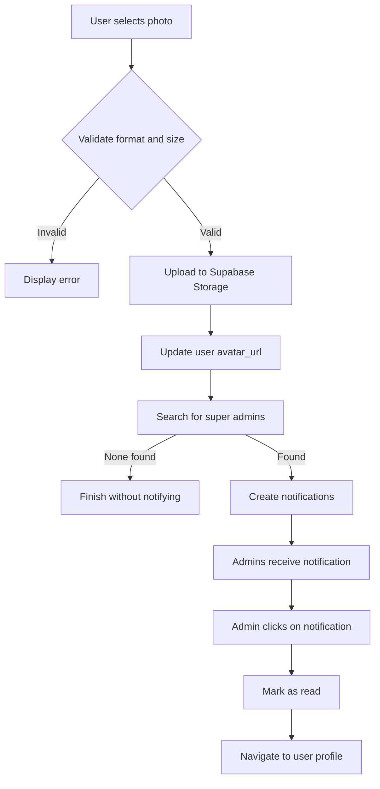

# Example: Notification on Profile Photo Change

This example demonstrates how to use the natural language flow system to implement a complete feature.

## 📄 Generated Files

### 1. Natural Language Flow
**File:** [`flows/notifications/change-profile-photo.flow`](file:///d:/AG/Siges/flows/notifications/change-profile-photo.flow)

This file describes the ENTIRE process in simple English:
- When it happens
- What to do in each step
- Necessary validations
- Error cases
- Required data

### 2. Reference TypeScript Code
**File:** [`flows/generated/notify-super-admin-on-profile-photo-change.ts`](file:///d:/AG/Siges/flows/generated/notify-super-admin-on-profile-photo-change.ts)

Complete TypeScript code generated from the flow:
- ✅ Typed interfaces
- ✅ Main function with all steps
- ✅ Helper functions (validation, upload, notification)
- ✅ Error handling
- ✅ Explanatory comments
- ✅ Usage example

### 3. Database Schema
**File:** [`supabase/migrations/20251227144500_create_users_notifications.sql`](file:///d:/AG/Siges/supabase/migrations/20251227144500_create_users_notifications.sql)

SQL to create the notifications table:
- ✅ Table structure
- ✅ Performance indexes
- ✅ Row Level Security (RLS)
- ✅ Automatic triggers
- ✅ Documentation comments

## 🎯 How the Flow Works

### Step 1: Write in Natural Language
```markdown
### 1. [User Selects New Photo]
**When:** The user accesses their profile and clicks to change the photo
**Action:** 
- User selects a new image from the device
- System validates image format (jpg, png, webp)
- System validates maximum size (5MB)
**Expected Result:** 
- Valid image is loaded in the interface
```

### Step 2: Automatically Generated Code
```typescript
// Validate format
const validFormats = ['image/jpeg', 'image/jpg', 'image/png', 'image/webp'];
if (!validFormats.includes(file.type)) {
  return {
    isValid: false,
    error: 'Invalid format. Use JPG, PNG or WEBP'
  };
}

// Validate size (5MB)
const maxSize = 5 * 1024 * 1024;
if (file.size > maxSize) {
  return {
    isValid: false,
    error: 'File too large. Maximum size: 5MB'
  };
}
```

## 💡 How to Use in Your Component

```typescript
import { notifySuperAdminOnProfilePhotoChange } from '@/flows/generated/notify-super-admin-on-profile-photo-change';

const ProfilePhotoUpload = () => {
  const handlePhotoChange = async (event: React.ChangeEvent<HTMLInputElement>) => {
    const file = event.target.files?.[0];
    if (!file) return;

    const result = await notifySuperAdminOnProfilePhotoChange({
      userId: currentUser.id,
      newPhotoFile: file,
      oldPhotoUrl: currentUser.avatar_url
    });

    if (result.success) {
      alert(`Photo updated! ${result.notificationsSent} admins notified.`);
    } else {
      alert(`Error: ${result.message}`);
    }
  };

  return (
    <input 
      type="file" 
      accept="image/jpeg,image/png,image/webp"
      onChange={handlePhotoChange}
    />
  );
};
```

## 🔄 Complete Process



## 📊 Data Structure

### `notifications` Table
| Field | Type | Description |
|-------|------|-----------|
| `id` | UUID | Unique notification ID |
| `user_id` | UUID | Who will receive the notification |
| `title` | VARCHAR | Notification title |
| `message` | TEXT | Full message |
| `type` | VARCHAR | Type (e.g., profile_photo_change) |
| `related_user_id` | UUID | Related user (optional) |
| `is_read` | BOOLEAN | If it has been read |
| `created_at` | TIMESTAMP | When it was created |
| `read_at` | TIMESTAMP | When it was read |

## ✅ Benefits of This Example

1. **No Programming**: The flow was written in simple natural language
2. **Complete Code**: Fully functional TypeScript was generated
3. **Database**: SQL schema ready to use
4. **Documentation**: Everything is automatically documented
5. **Reusable**: Can be used in any component
6. **Maintainable**: Update the flow and regenerate the code

## 🚀 Next Steps

1. **Apply the database migration**:
   ```bash
   # Run the SQL in supabase/migrations/20251227144500_create_users_notifications.sql
   ```

2. **Use the generated code**:
   - Import the function in your component
   - Call it when the user changes their photo
   - Handle the result (success/error)

3. **Create notifications component**:
   - List unread notifications
   - Mark as read on click
   - Navigate to the related profile

---

**Tip:** Use this example as a base to create your own flows! 🎯
