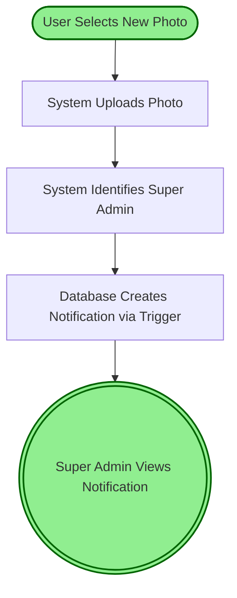

# 📚 Guia Completo: Como Gerar Código a partir de Flows

## 🎯 Visão Geral

O sistema de conversão de flows permite transformar documentação em linguagem natural (arquivos `.flow`) em:
- ✅ **Código TypeScript** de referência
- ✅ **Documentação Markdown** formatada  
- ✅ **Diagramas Mermaid** (flowcharts, sequência, estados)
- ✅ **Templates de Testes** Jest/Vitest

---

## 🚀 Como Usar

### **1. Converter um Flow Básico**

```bash
npm run flow-convert flows/servicesRequests/create-service-request.flow
```

**Saída:**
- `flows/generated/create-service-request.ts` - Código TypeScript
- `flows/generated/create-service-request.md` - Documentação

---

### **2. Gerar com Diagramas**

```bash
npm run flow-convert flows/notifications/change-profile-photo.flow --diagram
```

**Saída adicional:**
- `flows/generated/change-profile-photo.diagrams.md` - Diagramas Mermaid

**Exemplo de diagrama gerado:**



---

### **3. Gerar com Templates de Testes**

```bash
npm run flow-convert flows/servicesRequests/create-service-request.flow --test
```

**Saída adicional:**
- `flows/generated/create-service-request.test.ts` - Template de testes

---

### **4. Gerar Tudo (Código + Diagramas + Testes)**

```bash
npm run flow-convert flows/notifications/change-profile-photo.flow --diagram --test
```

---

## 📝 Estrutura de um Flow Completo

Para obter os melhores resultados, seu arquivo `.flow` deve ter:

### **1. Metadados YAML (Obrigatório)**

```yaml
---
name: Service Request Create
category: servicesRequests
version: 1.0.0
description: Fluxo para criação de uma nova Solicitação de Serviço
author: Seu Nome
date: 2026-01-11
---
```

### **2. Contexto**

```markdown
## Contexto
Este fluxo é executado quando um usuário autenticado cria uma nova Solicitação de Serviço.
```

### **3. Etapas do Fluxo**

```markdown
## Etapas do Fluxo

### 1. [Nome do Passo]
**Quando:**  
- Condição que dispara este passo

**Ação:**  
- O que o sistema deve fazer
- Pode ter múltiplas ações

**Resultado Esperado:**  
- Estado final esperado
```

### **4. Validações (Opcional)**

```markdown
## Validações Necessárias

### Validação de Dados
- Campo X deve ser obrigatório
- Campo Y deve ter formato Z
```

### **5. Casos de Erro (Opcional)**

```markdown
## Casos de Erro

### Erro de Upload
**Se:** Upload falha
**Então:** 
- Exibir mensagem de erro
- Manter dados anteriores
```

### **6. Dados Necessários (Opcional)**

```markdown
## Dados Necessários

### `users` Table
- `id` (UUID)
- `name_full` (string)
- `avatar_url` (string)
```

---

## 💡 Código Gerado - O que Você Recebe

### **TypeScript Reference (`*.ts`)**

```typescript
/**
 * Service Request Create
 * 
 * Categoria: servicesRequests
 * Versão: 1.0.0
 * 
 * ATENÇÃO: Este código foi gerado automaticamente
 * Use como REFERÊNCIA para implementação
 */

export interface ServiceRequestCreateInput {
  userId: string;
  // Adicione outros campos conforme necessário
}

export interface ServiceRequestCreateResult {
  success: boolean;
  message?: string;
  data?: any;
}

export async function serviceRequestCreate(
  input: ServiceRequestCreateInput
): Promise<ServiceRequestCreateResult> {
  try {
    // Passo 1: Acessar Tela de Solicitação de Serviço
    // TODO: Implementar passo 1
    
    // Passo 2: Preencher Formulário
    // TODO: Implementar passo 2
    
    return {
      success: true,
      message: 'Fluxo executado com sucesso'
    };
  } catch (error) {
    return {
      success: false,
      message: error instanceof Error ? error.message : 'Erro desconhecido'
    };
  }
}
```

### **Documentação Markdown (`*.md`)**

Documentação formatada e legível com todos os passos do flow.

### **Diagramas (`*.diagrams.md`)**

Três tipos de diagramas Mermaid:
1. **Flowchart** - Fluxo visual dos passos
2. **Sequence Diagram** - Interações entre componentes
3. **State Diagram** - Estados do sistema

### **Testes (`*.test.ts`)**

```typescript
describe('Service Request Create', () => {
  it('deve executar o fluxo completo com sucesso', async () => {
    const input: ServiceRequestCreateInput = {
      userId: 'test-user-id'
    };
    
    const result = await serviceRequestCreate(input);
    
    expect(result.success).toBe(true);
  });
  
  it('Passo 1: Acessar Tela de Solicitação de Serviço', async () => {
    // TODO: Implementar teste
  });
});
```

---

## 🔧 Como Usar o Código Gerado

### **1. Copie as Interfaces**

```typescript
// Em seu arquivo de tipos
export interface ServiceRequestCreateInput {
  userId: string;
  clientId: number;
  unitId: number;
  // ... adicione campos do seu formulário
}
```

### **2. Implemente a Função**

```typescript
// Em seu service/dataService.ts
import { ServiceRequestCreateInput, ServiceRequestCreateResult } from './types';

export async function createServiceRequest(
  input: ServiceRequestCreateInput
): Promise<ServiceRequestCreateResult> {
  // Implemente baseado nos comentários do código gerado
  
  // Passo 1: Validar dados
  if (!input.userId || !input.clientId) {
    return { success: false, message: 'Dados obrigatórios faltando' };
  }
  
  // Passo 2: Inserir no banco
  const { data, error } = await supabase
    .from('orders')
    .insert({
      user_id: input.userId,
      client_id: input.clientId,
      // ... outros campos
    });
    
  if (error) {
    return { success: false, message: error.message };
  }
  
  return { success: true, data };
}
```

### **3. Use os Testes como Base**

```typescript
// Adapte os testes gerados para seu caso
describe('createServiceRequest', () => {
  it('deve criar uma solicitação de serviço', async () => {
    const input = {
      userId: '123',
      clientId: 456,
      unitId: 789
    };
    
    const result = await createServiceRequest(input);
    
    expect(result.success).toBe(true);
    expect(result.data).toBeDefined();
  });
});
```

---

## 📊 Benefícios

✅ **Documentação sempre atualizada** - Flow é a fonte da verdade  
✅ **Código consistente** - Todos seguem a mesma estrutura  
✅ **Testes completos** - Template cobre todos os casos  
✅ **Visualização clara** - Diagramas facilitam entendimento  
✅ **Onboarding rápido** - Novos devs entendem o fluxo facilmente  

---

## 🎨 Próximos Passos

1. **Crie seus flows** seguindo o template
2. **Gere o código** com `npm run flow-convert`
3. **Implemente** baseado no código gerado
4. **Teste** usando os templates de teste
5. **Mantenha atualizado** - Atualize o flow quando a lógica mudar

---

## 💡 Dicas

- **Seja específico** nos passos - quanto mais detalhes, melhor o código gerado
- **Inclua validações** - elas viram testes automaticamente
- **Documente erros** - casos de erro viram testes de exceção
- **Use diagramas** - facilitam code review e discussões técnicas

---

**Criado em:** 2026-01-11  
**Versão:** 1.0.0
