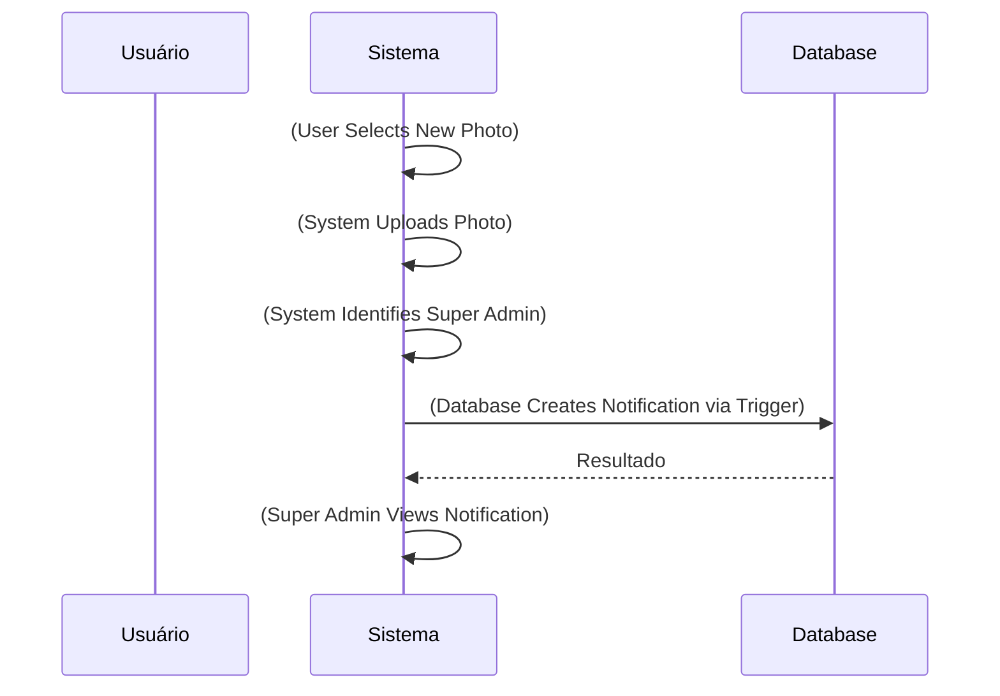
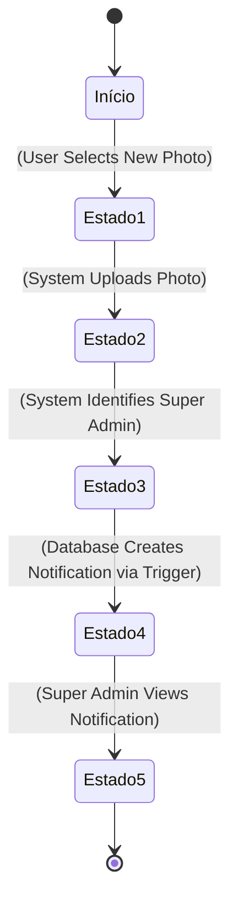

# Notify Super Admin on Profile Photo Change - Diagramas

**Categoria:** notifications  
**Versão:** 1.0.0

---

## Fluxograma

```mermaid
flowchart TD
    step1([(User Selects New Photo)])
    step2[(System Uploads Photo)]
    step3[(System Identifies Super Admin)]
    step4[(Database Creates Notification via Trigger)]
    step5((((Super Admin Views Notification))))
    step1 --> step2
    step2 --> step3
    step3 --> step4
    step4 --> step5

    %% Estilos
    classDef startEnd fill:#90EE90,stroke:#006400,stroke-width:2px
    classDef validation fill:#FFE4B5,stroke:#FF8C00,stroke-width:2px
    class step1 startEnd
    class step5 startEnd
```

## Diagrama de Sequência



## Diagrama de Estados



