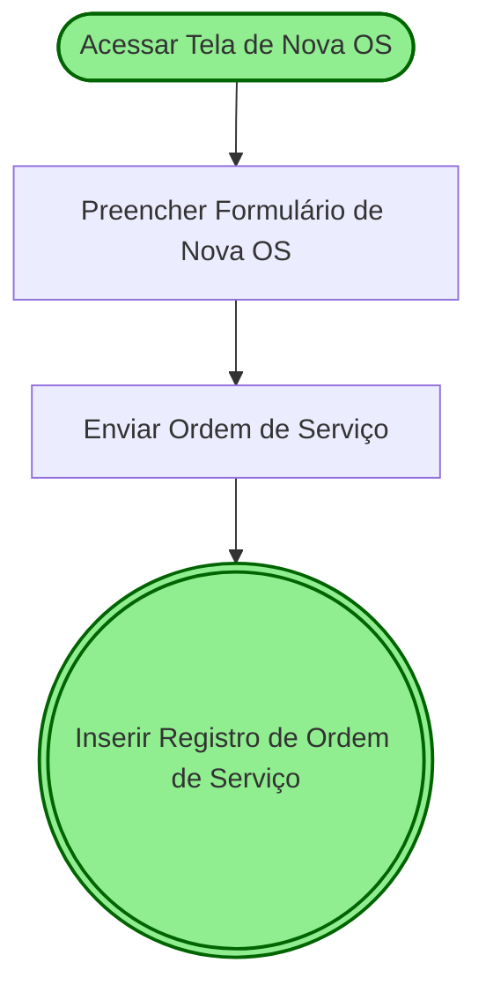
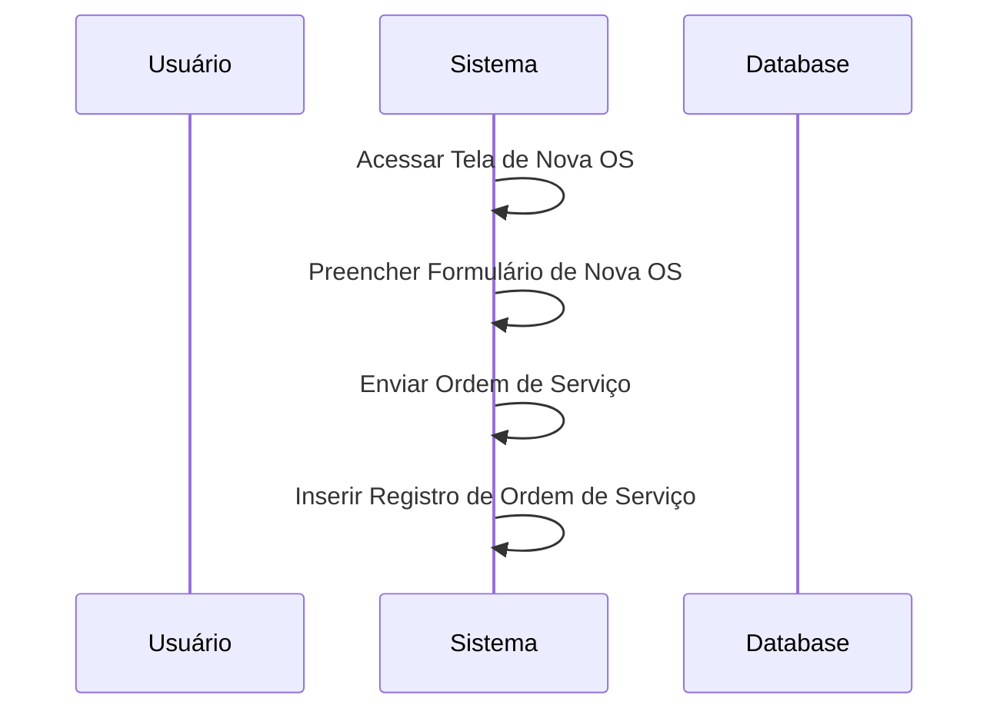
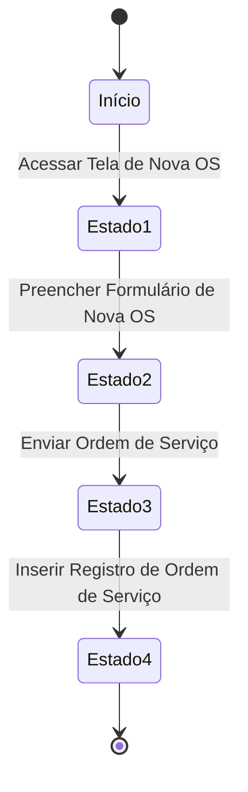

# Order Request Create - Diagramas

**Categoria:** ordersRequests  
**Versão:** 1.0.0

---

## Fluxograma

```mermaid
flowchart TD
    step1([Acessar Tela de Nova OS])
    step2[Preencher Formulário de Nova OS]
    step3[Enviar Ordem de Serviço]
    step4(((Inserir Registro de Ordem de Serviço)))
    step1 --> step2
    step2 --> step3
    step3 --> step4

    %% Estilos
    classDef startEnd fill:#90EE90,stroke:#006400,stroke-width:2px
    classDef validation fill:#FFE4B5,stroke:#FF8C00,stroke-width:2px
    class step1 startEnd
    class step4 startEnd
```

## Diagrama de Sequência

```mermaid
sequenceDiagram
    participant U as Usuário
    participant S as Sistema
    participant DB as Database

    S->>S: Acessar Tela de Nova OS
    S->>S: Preencher Formulário de Nova OS
    S->>S: Enviar Ordem de Serviço
    S->>S: Inserir Registro de Ordem de Serviço
```

## Diagrama de Estados

```mermaid
stateDiagram-v2
    [*] --> Início
    Início --> Estado1: Acessar Tela de Nova OS
    Estado1 --> Estado2: Preencher Formulário de Nova OS
    Estado2 --> Estado3: Enviar Ordem de Serviço
    Estado3 --> Estado4: Inserir Registro de Ordem de Serviço
    Estado4 --> [*]
```

