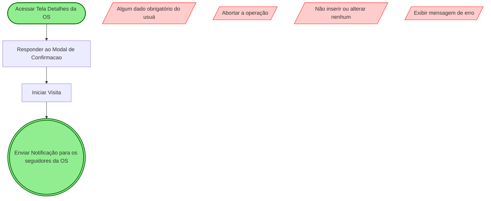
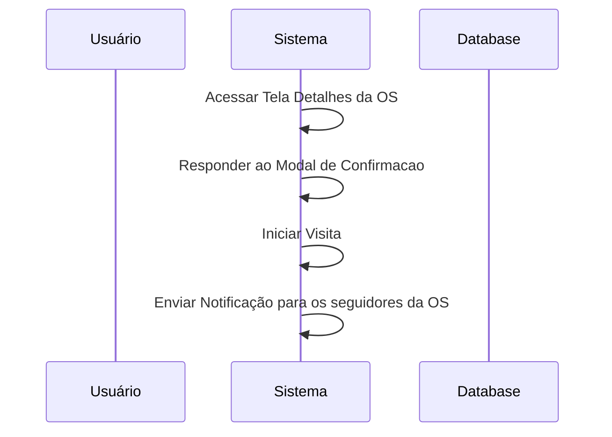
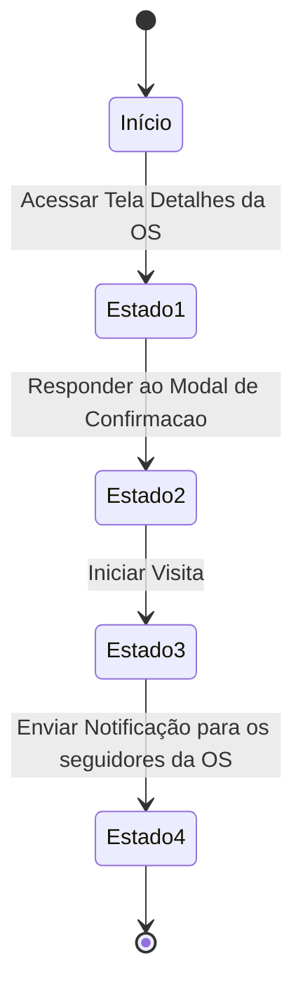

# Order Visit Create - Diagramas

**Categoria:** ordersVisits  
**Versão:** 1.0.0

---

## Fluxograma

```mermaid
flowchart TD
    step1([Acessar Tela Detalhes da OS])
    step2[Responder ao Modal de Confirmacao]
    step3[Iniciar Visita]
    step4(((Enviar Notificação para os seguidores da OS)))
    step1 --> step2
    step2 --> step3
    step3 --> step4

    %% Casos de Erro
    error1[/Algum dado obrigatório do usuá/]
    style error1 fill:#ffcccc,stroke:#ff0000
    error2[/Abortar a operação/]
    style error2 fill:#ffcccc,stroke:#ff0000
    error3[/Não inserir ou alterar nenhum/]
    style error3 fill:#ffcccc,stroke:#ff0000
    error4[/Exibir mensagem de erro/]
    style error4 fill:#ffcccc,stroke:#ff0000

    %% Estilos
    classDef startEnd fill:#90EE90,stroke:#006400,stroke-width:2px
    classDef validation fill:#FFE4B5,stroke:#FF8C00,stroke-width:2px
    class step1 startEnd
    class step4 startEnd
```

## Diagrama de Sequência

```mermaid
sequenceDiagram
    participant U as Usuário
    participant S as Sistema
    participant DB as Database

    S->>S: Acessar Tela Detalhes da OS
    S->>S: Responder ao Modal de Confirmacao
    S->>S: Iniciar Visita
    S->>S: Enviar Notificação para os seguidores da OS
```

## Diagrama de Estados

```mermaid
stateDiagram-v2
    [*] --> Início
    Início --> Estado1: Acessar Tela Detalhes da OS
    Estado1 --> Estado2: Responder ao Modal de Confirmacao
    Estado2 --> Estado3: Iniciar Visita
    Estado3 --> Estado4: Enviar Notificação para os seguidores da OS
    Estado4 --> [*]
```

