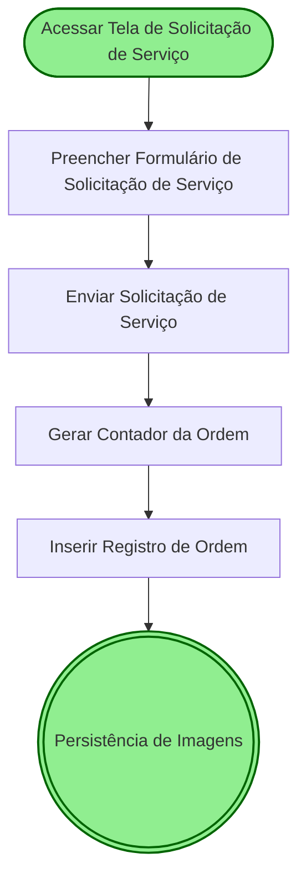
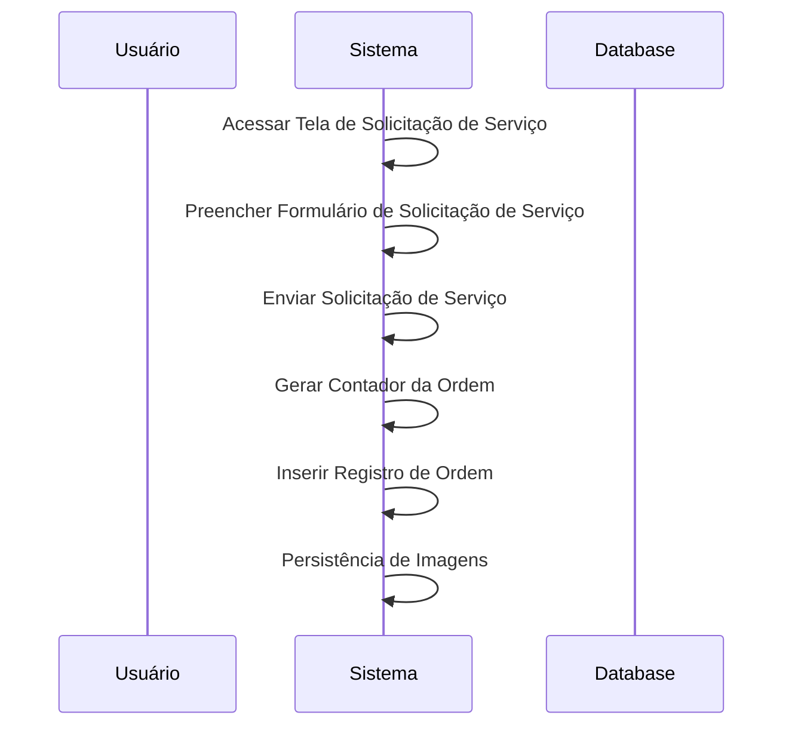
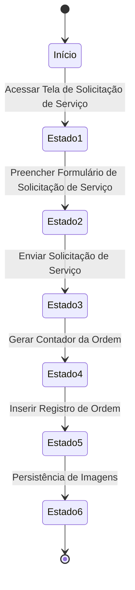

# Service Request Create - Diagramas

**Categoria:** servicesRequests  
**Versão:** 1.0.0

---

## Fluxograma

```mermaid
flowchart TD
    step1([Acessar Tela de Solicitação de Serviço])
    step2[Preencher Formulário de Solicitação de Serviço]
    step3[Enviar Solicitação de Serviço]
    step4[Gerar Contador da Ordem]
    step5[Inserir Registro de Ordem]
    step6(((Persistência de Imagens)))
    step1 --> step2
    step2 --> step3
    step3 --> step4
    step4 --> step5
    step5 --> step6

    %% Estilos
    classDef startEnd fill:#90EE90,stroke:#006400,stroke-width:2px
    classDef validation fill:#FFE4B5,stroke:#FF8C00,stroke-width:2px
    class step1 startEnd
    class step6 startEnd
```

## Diagrama de Sequência

```mermaid
sequenceDiagram
    participant U as Usuário
    participant S as Sistema
    participant DB as Database

    S->>S: Acessar Tela de Solicitação de Serviço
    S->>S: Preencher Formulário de Solicitação de Serviço
    S->>S: Enviar Solicitação de Serviço
    S->>S: Gerar Contador da Ordem
    S->>S: Inserir Registro de Ordem
    S->>S: Persistência de Imagens
```

## Diagrama de Estados

```mermaid
stateDiagram-v2
    [*] --> Início
    Início --> Estado1: Acessar Tela de Solicitação de Serviço
    Estado1 --> Estado2: Preencher Formulário de Solicitação de Serviço
    Estado2 --> Estado3: Enviar Solicitação de Serviço
    Estado3 --> Estado4: Gerar Contador da Ordem
    Estado4 --> Estado5: Inserir Registro de Ordem
    Estado5 --> Estado6: Persistência de Imagens
    Estado6 --> [*]
```

