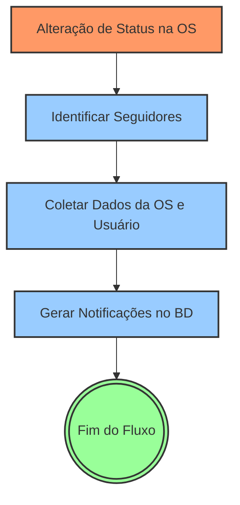
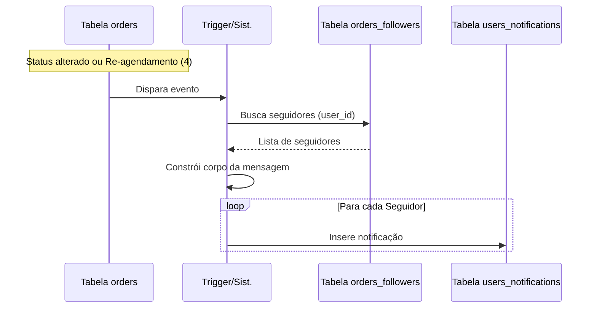
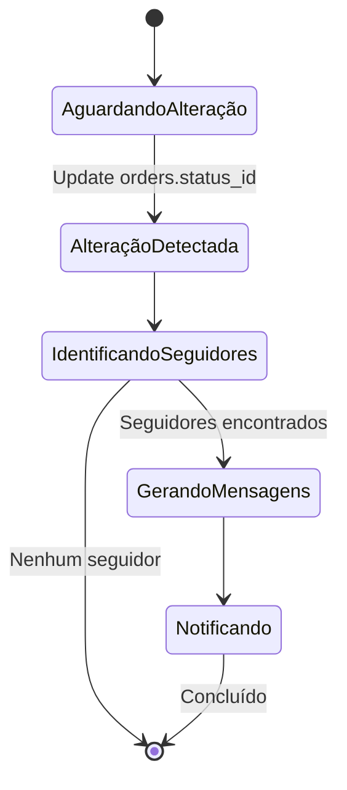

# Notificar Seguidores na Alteração de Situação de OS - Diagramas

**Categoria:** notifications  
**Versão:** 1.2.0  

---

## Fluxograma

```mermaid
flowchart TD
    trigger[Alteração de Status na OS] --> step1[Identificar Seguidores]
    step1 --> step2[Coletar Dados da OS e Usuário]
    step2 --> step3[Gerar Notificações no BD]
    step3 --> endNode(((Fim do Fluxo)))

    %% Estilos
    classDef triggerNode fill:#f96,stroke:#333,stroke-width:2px
    classDef processNode fill:#9cf,stroke:#333,stroke-width:2px
    classDef endNode fill:#9f9,stroke:#333,stroke-width:2px
    
    class trigger triggerNode
    class step1,step2,step3 processNode
    class endNode endNode
```

## Diagrama de Sequência

```mermaid
sequenceDiagram
    participant OS as Tabela orders
    participant TG as Trigger/Sist.
    participant FL as Tabela orders_followers
    participant UN as Tabela users_notifications

    Note over OS: Status alterado ou Re-agendamento (4)
    OS->>TG: Dispara evento
    TG->>FL: Busca seguidores (user_id)
    FL-->>TG: Lista de seguidores
    TG->>TG: Constrói corpo da mensagem
    loop Para cada Seguidor
        TG->>UN: Insere notificação
    end
```

## Diagrama de Estados

```mermaid
stateDiagram-v2
    [*] --> AguardandoAlteração
    AguardandoAlteração --> AlteraçãoDetectada: Update orders.status_id
    AlteraçãoDetectada --> IdentificandoSeguidores
    IdentificandoSeguidores --> GerandoMensagens: Seguidores encontrados
    IdentificandoSeguidores --> [*]: Nenhum seguidor
    GerandoMensagens --> Notificando
    Notificando --> [*]: Concluído
```
