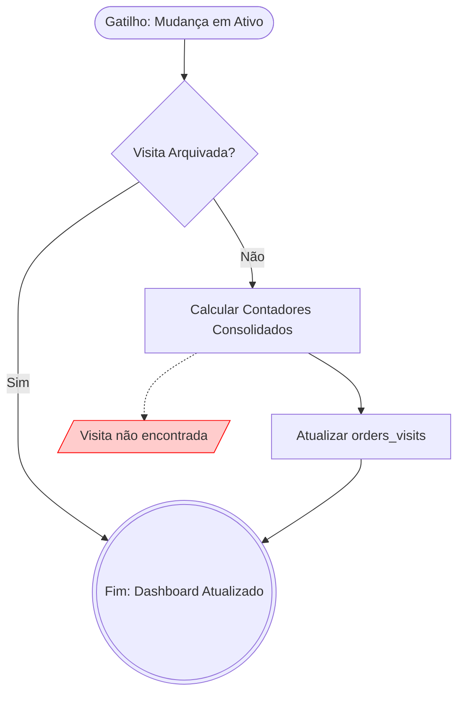
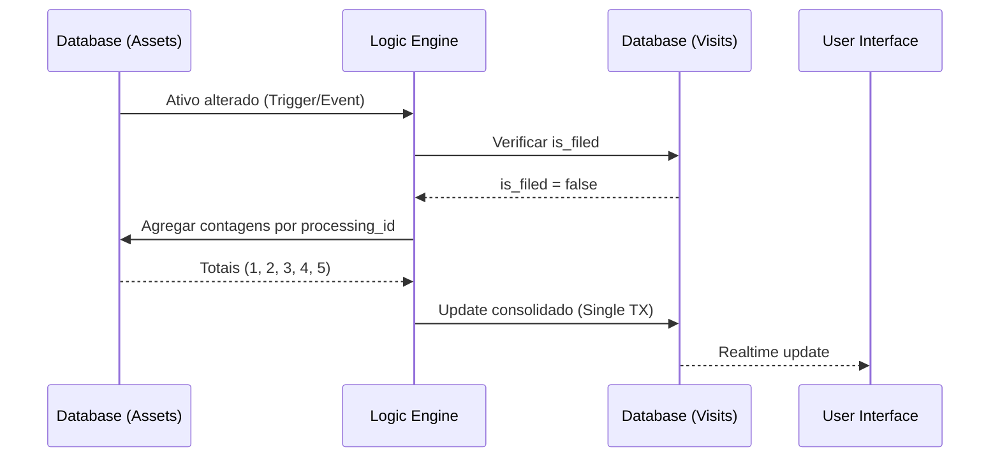
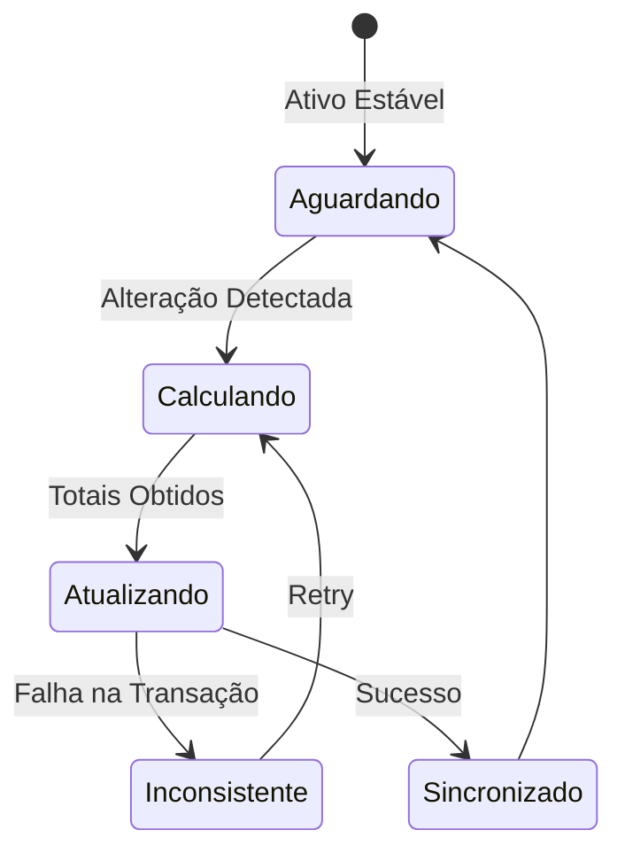

# Order Visit Assets Processing - Diagramas

**Categoria:** ordersVisitsAssets  
**Versão:** 1.1.0

---

## Fluxograma

```mermaid
flowchart TD
    trigger([Gatilho: Mudança em Ativo])
    check{Visita Arquivada?}
    calculate[Calcular Contadores Consolidados]
    update[Atualizar orders_visits]
    finish(((Fim: Dashboard Atualizado)))

    trigger --> check
    check -- Não --> calculate
    check -- Sim --> finish
    calculate --> update
    update --> finish

    %% Casos de Erro
    error1[/Visita não encontrada/]
    style error1 fill:#ffcccc,stroke:#ff0000
    
    calculate -.-> error1
```

## Diagrama de Sequência

```mermaid
sequenceDiagram
    participant DB as Database (Assets)
    participant S as Logic Engine
    participant V as Database (Visits)
    participant UI as User Interface

    DB->>S: Ativo alterado (Trigger/Event)
    S->>V: Verificar is_filed
    V-->>S: is_filed = false
    S->>DB: Agregar contagens por processing_id
    DB-->>S: Totais (1, 2, 3, 4, 5)
    S->>V: Update consolidado (Single TX)
    V-->>UI: Realtime update
```

## Diagrama de Estados

```mermaid
stateDiagram-v2
    [*] --> Aguardando: Ativo Estável
    Aguardando --> Calculando: Alteração Detectada
    Calculando --> Atualizando: Totais Obtidos
    Atualizando --> Inconsistente: Falha na Transação
    Inconsistente --> Calculando: Retry
    Atualizando --> Sincronizado: Sucesso
    Sincronizado --> Aguardando
```
